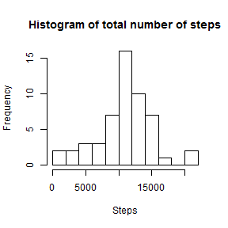
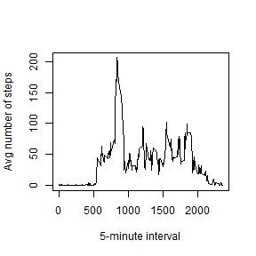
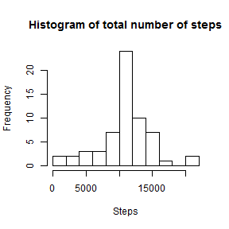
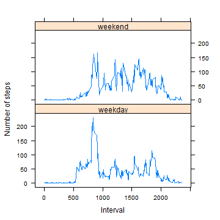

Reproducible Research: Peer Assessment 1
========================================================
The goal of this project is to analyze data about personal movement using activity monitoring devices. Such data are used for a variety of reasons, including finding patterns in a person's behavior or improving one's health. 
The data used in this study were measured using a personal activity monitoring device and include number of steps taken in 5 minute intervals each day for a period of two months from October to November 2012.


## Loading and preprocessing the data

For the purposes of this project the data where manually downloaded from [Activity monitoring data](https://d396qusza40orc.cloudfront.net/repdata%2Fdata%2Factivity.zip) and unzipped to a comma-separated-value (csv) file in the working directory. The dataset was loaded into R in a data frame with the following variables:

- steps: Number of steps taken in a 5-minute interval
- date: The date on which the measurement was taken in YYYY-MM-DD format
- interval: Identifier for the 5-minute interval in which measurement was taken

Furthermore, date was converted into a date format, so that it could be easier used in the analysis.


```r
setwd("C:/Personal/Classes/Coursera/Reproducible Research/Peer Assessments/Peer Assessment 1")
activity <- read.csv("activity.csv", stringsAsFactors=FALSE)
activity$date <- as.Date(activity$date, format="%Y-%m-%d")
```

## What is mean total number of steps taken per day?

In order to calculate the number of steps taken per day, the number of steps were aggregated over each day. The resulting histogram is presented below.


```r
steps_per_day <- aggregate(steps ~ date, data=activity, FUN=sum)  # Calculate total number of steps for each day
hist(steps_per_day$steps, main="Histogram of total number of steps", xlab="Steps", breaks=10)
```

 

The mean and median total number of steps taken per day are calculated as follows.


```r
mean(steps_per_day$steps)
```

```
## [1] 10766
```

```r
median(steps_per_day$steps)
```

```
## [1] 10765
```

## What is the average daily activity pattern?

In order to compare the number of steps across various 5-minute intervals, we calculated the average number of steps averaged across all days. The results can be shown in the following plot in the form of a time series plot.


```r
steps_per_interval <- aggregate(steps ~ interval, data=activity, FUN=mean)  # Calculate average number of steps for each interval
plot(steps_per_interval$interval, steps_per_interval$steps, xlab="5-minute interval", ylab="Avg number of steps", type="l")
```

 

From the above plot it can be seen that there is a large peak at around 5-minute interval 800. The exact interval which contains on average the maximum number of steps can be computed as follows and corresponds to interval 835 with 206.1698 steps on average.


```r
steps_per_interval[steps_per_interval$steps==max(steps_per_interval$steps), ]
```

```
##     interval steps
## 104      835 206.2
```

## Imputing missing values

The original data set contains a number of days and measurements with na values for number of steps. The total number of rows with missing values equals to 2304.


```r
sum(is.na(activity$steps))
```

```
## [1] 2304
```

In order to overcome this problem we decided to fill in all of the missing values in the dataset. The strategy we followed was to replace every missing value for a date and 5-minute interval with the average number of steps for that specific interval. So we created a new dataset that is equal to the original one, containing an extra variable with the missing data filled in.


```r
new <- merge(activity, steps_per_interval, by.x="interval", by.y="interval")
new$"steps" <- new$steps.x	# Create new variable called steps and initialize it with original values
for(i in 1:nrow(new)) {
  if(is.na(new$"steps"[i])) {new$"steps"[i] <- new$"steps.y"[i]}	# if steps is NA replace with mean steps for the time interval
}
```

A histogram of the total number of steps taken each day, after imputing the missing values, is presented below.


```r
new_steps_per_day <- aggregate(steps ~ date, data=new, FUN=sum)  # Calculate total number of steps for each day
hist(new_steps_per_day$steps, main="Histogram of total number of steps", xlab="Steps", breaks=10)
```

 

Also the mean and median in correspondance with those in the previous paragraph are next calculated.


```r
mean(new_steps_per_day$steps)
```

```
## [1] 10766
```

```r
median(new_steps_per_day$steps)
```

```
## [1] 10766
```
If we examine the above values in comparison with the mean and median before imputing the missing values we can see that the difference between the two is negligible. Also, the two histograms suggest that although the frequencies of the number of steps have increased, the distribution has roughly staid the same.

## Are there differences in activity patterns between weekdays and weekends?

Our next goal is to see if there is a difference in activity patterns between weekdays and weekends. In order to accomplish this, we added two variables in our data set, one referring to the name of the day and another one indicating whether it is a weekday or a weekend day.


```r
new$day <- weekdays(new$date)  # Get day for each date
new$day_type <- "weekday"	# Create new variable named day_type and initialize it with value "weekday"
new$day_type[weekdays(new$date)=="Saturday" | weekdays(new$date)=="Sunday"] <- "weekend"	# If day is Saturday or Sunday update day_type to "weekend"
new$day_type <- as.factor(new$day_type)	# Convert day_type to factor variable
```

The following figure shows a panel plot containing a time series plot of the 5-minute interval and the average number of steps taken, averaged across all weekday days or weekend days.


```r
new_steps_per_interval <- aggregate(steps ~ interval + day_type, data=new, FUN=mean)	# Calculate average number of steps for each interval
library(lattice)
xyplot(steps ~ interval | day_type, data = new_steps_per_interval, layout = c(1,2), xlab="Interval", ylab="Number of steps", type="l")
```

 

From the following plot we can notice some difference in activity patterns between weekdays and weekends. The plot suggests that while during weekdays there is a large number of steps at the morning (roughly between intervals 800 and 900), on weekends there is a smoother distribution across all day. This could be explained by the fact that on weekdays people tend to make more steps in the morning when going to work, while on weekend there is no specific hour one leaves the house or  performs specific activities.

